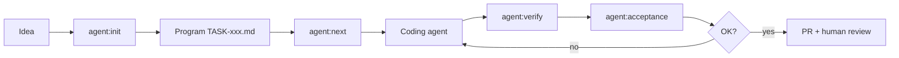

# Agent Loop

**Turn your repo into a job queue for coding agents.**

Most teams treat every agent session like a fresh hire: long prompts, lost context, subjective “done.”  
Agent Loop flips that: **each task is a Markdown program in git**, a JSON queue on disk, and verify gates the agent cannot skip.

Open a **new** Cursor, Claude Code, or Codex chat, send a one-word message like **`go`** or **`vai`**, and the agent picks the next pending task, reads the contract, does the work, and runs checks. No essay in chat. No amnesia on retry.

```text
You (new chat):  go

Agent:           read .agent-loop/queue.json
                 open specs/agent-tasks/TASK-002.md
                 implement scope + tick acceptance - [x]
                 run agent:verify on touched packages
You:             review PR against the program file, not chat memory
```

That is the idea: **structure lives in the repo; the agent is the worker.**

---

## Try it in 60 seconds

| Step | You | Result |
| ---- | --- | ------ |
| 1 | `pnpm agent:init TASK-001 "Fix mobile nav"` | Program file + queue entry on disk |
| 2 | Edit Objective and Acceptance (`- [ ]`) in [Agent Console](tools/agent-gui/), **Save** | Contract in git, not Slack |
| 3 | Open a **new** agent session in this repo | Clean context; rules still on disk |
| 4 | Send **`go`**, **`vai`**, or **`next task`** | Agent loads queue and executes TASK-001 |
| 5 | `pnpm agent:verify` (or Cursor hook on stop) | Lint / typecheck / test on touched paths only |

**Example messages that work** (any short nudge is fine):

```text
go
start
next task
vai
parti
```

You do not paste the whole program into chat. The agent reads `specs/agent-tasks/TASK-001.md` itself.

**Example program excerpt** (`specs/agent-tasks/TASK-001.md`):

```markdown
## Objective
Make the nav usable on 320px screens without horizontal scroll.

## Constraints
- Touch only `apps/web/`
- No autonomous merge

## Acceptance criteria
- [ ] No horizontal scroll at 320px
- [ ] Existing desktop layout unchanged
- [ ] `pnpm agent:verify` passes
```

---

## The problem today

Building with AI agents does not fail because models lack intelligence. It fails because **structure is missing**.

| Symptom | What happens |
| -------- | ------------- |
| Monolithic prompts | The agent loses goal, scope, and constraints mid-session |
| No gates | The agent declares “done” without tests, lint, or verifiable acceptance |
| State only in chat | Context fills up, early instructions fade, errors compound |
| Autonomous demos | Works in videos, breaks in your monorepo with CI, branch policy, and human review |
| Tool lock-in | Workflow tied to Cursor *or* Claude, hard to run in hybrid teams |

The result: apparent speed, real technical debt, and human reviewers reconstructing what the agent was supposed to do.

---

## Real workflows: typical vs Agent Loop

Same task, two ways to run it. Example: **“Add a delete button for draft/pending tasks in the Agent Console sidebar.”**

### What most teams do today

```text
Slack / standup          →  “Can someone add task delete in the GUI?”
Cursor chat (Composer)   →  one long message with context, links, “don’t break X”
Agent session            →  edits HTML, JS, server; no written contract
“Looks good”             →  agent says done; dev opens PR from memory
CI                       →  lint fails on server.mjs; test suite not run locally
Review                   →  reviewer asks: “Should DELETE work on in_progress too?”
Rework                   →  new chat thread; earlier constraints forgotten
Merge                    →  maybe, after 2–3 review rounds
```

**Artifacts on disk**

| Exists? | Artifact |
| ------- | -------- |
| ❌ | Task spec with acceptance criteria |
| ❌ | Queue / priority when three tasks are in flight |
| ❌ | Scratchpad outside chat |
| ✅ | `.cursor/` chat history (not in git) |
| ✅ | A PR whose description ≠ what was actually agreed |

**Typical chat prompt (paraphrased)**

```text
In tools/agent-gui, add a way to delete tasks from the sidebar.
Only pending and draft. Wire DELETE on the server.
Don’t remove the stop button. Use our existing patterns.
Run tests when you’re done.
```

**What goes wrong**

- Scope creeps: agent also refactors `task-sidebar.js` styling “while here”.
- “Done” is subjective: no checklist; reviewer discovers missing edge cases in review.
- Verify is optional: agent skips `pnpm test` or runs only `lint` on one package.
- Context loss: retry in a **new** chat → “delete only pending” rule is gone; agent deletes `in_progress` too.
- Human cost: reviewer reads the whole diff to infer intent.

**Timeline (realistic)**

| Time | Event |
| ---- | ----- |
| T+0 | 15-minute prompt + agent run |
| T+1h | PR opened, CI red (eslint) |
| T+1d | Fix in new chat; unrelated file touched |
| T+2d | Approved with caveats; tech debt logged in issue |

---

### With Agent Loop (same task)

**1. Create the program (contract on disk)**

```bash
pnpm agent:init TASK-042 "Delete draft/pending tasks from sidebar"
```

`specs/agent-tasks/TASK-042.md` (excerpt):

```markdown
## Objective

Users can remove pending or draft tasks from the Agent Console sidebar;
in_progress and done tasks cannot be deleted.

## Constraints

- No autonomous merge
- Touch only `tools/agent-gui/` (server, sidebar, app wiring)
- Do not change agent start/stop behavior

## Acceptance criteria

- [ ] Sidebar shows delete control only for `pending` and `draft`
- [ ] `DELETE /api/tasks/:id` returns 404 for unknown id, 400 for non-deletable status
- [ ] Selecting another task after delete updates Activity and Program panes
- [ ] `pnpm agent:verify` passes on touched packages

## Scope

| Packages | `tools/agent-gui/` |
| Branch   | `agent/task-042` → PR on `main` |
```

`.agent-loop/queue.json` gets `{ "id": "TASK-042", "status": "pending", "program": "specs/agent-tasks/TASK-042.md" }`.

**2. Start the agent with the program, not a one-off prompt**

```bash
pnpm agent:next --json    # or Agent Console → Run on TASK-042
```

The agent receives the **file contents** plus loop instructions (branch name, scratchpad, verify steps), not a fading chat preamble.

**3. Agent works; state stays in the repo**

```text
.agent-loop/scratchpad.md     →  “Added DELETE route; wiring deleteTask()…”
specs/agent-tasks/TASK-042.md →  acceptance `- [x]` as items complete
git branch agent/task-042       →  focused diff
```

**4. Deterministic gates (agent cannot self-certify)**

```bash
pnpm agent:verify      # lint + typecheck + test on touched packages only
pnpm agent:acceptance TASK-042   # all `- [ ]` must be `- [x]`
```

On Cursor stop, the **`agent-verify`** hook runs the same verify; exit code 1 keeps the session “not done”.

**5. Human review**

PR description links to `TASK-042.md`. Reviewer checks:

- Diff matches **Constraints** (only `tools/agent-gui/`).
- Acceptance list is fully checked.
- CI + local verify already green.

Merge is a business decision, not archaeology.

**Timeline (realistic)**

| Time | Event |
| ---- | ----- |
| T+0 | 5-minute program + `agent:init` |
| T+30m | Agent run; verify fails → agent fixes before claiming done |
| T+45m | PR open; acceptance 4/4; reviewer skim + merge |
| T+1h | Shipped with auditable contract |

---

### Side-by-side

| | Typical agent chat | Agent Loop |
| --- | --- | --- |
| **Spec** | In chat / in someone’s head | `specs/agent-tasks/TASK-042.md` in git |
| **Queue** | Sticky notes, GitHub issues, DMs | `.agent-loop/queue.json` |
| **Working memory** | Context window | `scratchpad.md` + program file |
| **“Done”** | Agent says so | Acceptance `- [x]` + `agent:verify` + optional `DONE` in scratchpad |
| **Verify** | “Please run tests” (honor system) | `agent:verify` + hooks on touched packages |
| **Retry** | New chat, lost constraints | Same program; `agent:next` again |
| **Review** | Reconstruct intent from diff | Read program + checklist + diff |
| **Backend** | Locked to one IDE | `AGENT_BACKEND=cursor` or `claude` |

### Second example: monorepo bug (one line in chat vs program)

**Today:** *“Fix the checkout total when a coupon is applied, probably in apps/web.”*  
Agent edits `packages/pricing`, `apps/admin`, and `apps/web`; breaks admin tests; no one noticed until CI on `main`.

**Agent Loop:** Program lists **Packages: `apps/web`, `packages/pricing` only**; verify runs lint/typecheck/test **only on those paths**; acceptance includes *“Admin checkout unchanged (snapshot or test name X still passes).”* Scope and proof are in the repo before the first line of code.

---

## What Karpathy, Google, and the industry say

This is not an exotic pattern. It is where production agent builders are converging.

### Andrej Karpathy: partial autonomy, not full autonomy

In [*Software Is Changing (Again)*](https://www.youtube.com/watch?v=LCEmiRjPEtQ) (2025), Karpathy describes the shift from **Software 1.0** (code) and **Software 2.0** (neural nets) to **Software 3.0** (natural-language programs / prompts). Three ideas that shape Agent Loop:

1. **“This is the decade of agents”**: not the year of agents. Patience, iteration, and humans in the loop ([source](https://www.latent.space/p/s3)).
2. **Generation ↔ verification loop**: AI generates; infrastructure *verifies* quickly. The tighter the loop, the farther you can move the autonomy slider safely.
3. **Build for agents**: Markdown docs, executable CLI commands, parseable repos (not “click here”). A third consumer besides humans (GUI) and machines (APIs).

> *“Build Iron Man suits, not Iron Man robots.”*: controlled partial autonomy, not agents that merge on their own.

References: [Software 2.0 (2017)](https://karpathy.medium.com/software-2-0-a64152a37a35) · [Latent Space: Software 3.0](https://www.latent.space/p/s3)

### Google: agentic engineering, not prompt engineering alone

The [Google Developers Blog](https://developers.googleblog.com/build-better-ai-agents-5-developer-tips-from-the-agent-bake-off/) (Agent Bake-Off, 2025): moving from demo to production requires **agentic engineering**: multi-step architecture, state management, **deterministic guardrails**.

Winning pattern: the LLM reasons and extracts intent; **traditional code** runs calculations, queries, and validation. The AI must not self-certify its own work.

### Anthropic, AGENTS.md, and harness engineering

- [**Claude Code: Best practices**](https://code.claude.com/docs/en/best-practices): limited context, explore → plan → code, **give the agent a way to verify its work**, explicit permissions.
- [**AGENTS.md**](https://agents.md/): open standard (Cursor, GitHub Copilot, OpenAI Codex, Linux Foundation Agentic AI Foundation): project instructions in Markdown, versioned in the repo, not buried in chat.
- **Harness engineering** ([2026 field guide](https://genalphai.com/agentic-loops-and-harness-engineering/)): Plan → Execute → Verify loops; state on disk and git; executable gates (`test`, `lint`, `review`) the agent **cannot bypass**.

### Industry summary → practical requirements

```text
Declarative spec (what, constraints, acceptance)
        ↓
Agent executes (generation)
        ↓
Deterministic gates (verification)
        ↓
Human review → merge
```

Agent Loop implements this chain in your repository, with tools you already use.

---

## The solution: Agent Loop

**Agent Loop** is an installable kit that brings a **Karpathy-style** workflow into any repo, without pretending to be fully autonomous.

```text
Vague idea → program.md → coding agent → verify → PR → human review → merge
```

### Principles

| Principle | Implementation |
| --------- | -------------- |
| One task = one contract | `specs/agent-tasks/TASK-001.md` (objective, constraints, acceptance `- [ ]`) |
| Queue and state outside chat | `.agent-loop/queue.json`, `scratchpad.md` |
| Non-negotiable verify | `agent:verify` (lint, typecheck, test on touched packages) |
| Explicit acceptance | `agent:acceptance`: program checklist |
| Partial autonomy | Optional Cursor hooks; no autonomous merge |
| Backend agnostic | Cursor CLI (`agent`), Claude Code (`claude`), or Codex (`codex`) |

### What the kit includes

| Component | Purpose |
| --------- | ------- |
| `specs/agent-tasks/*.md` | Task programs |
| `.agent-loop/` | Queue, scratchpad, kit version, autostart |
| `scripts/agent/` | CLI: init, next, verify, acceptance, update |
| `tools/agent-gui/` | Web console (Create, Program, AI); PR status per task via `gh` |
| `.cursor/hooks/` | Cursor adapter (inject task, verify on stop, **ensure GUI** on session start) |
| `.cursor/skills/` | `update` and `uninstall` skills |
| `agent-loop.config.json` | Verify, branches, update check |

### Operational flow



---

## Quick start

**Requirements:** Node.js 22+, Git, repo with `lint` / `typecheck` / `test` scripts, at least one agent CLI (installed and authenticated). [**GitHub CLI**](https://cli.github.com/) (`gh`) is optional (PR badges in Agent Console).

| Backend | CLI | Docs |
| ------- | --- | ---- |
| Cursor | `agent` | [Cursor CLI](https://cursor.com/docs/cli/overview) |
| Claude Code | `claude` | [Claude Code setup](https://code.claude.com/docs/en/setup) |
| OpenAI Codex | `codex` | [Codex CLI](https://developers.openai.com/codex) |
| GitHub (optional) | `gh` | [GitHub CLI manual](https://cli.github.com/manual/) |

```bash
git clone https://github.com/ciroaurelio22/AgentLoop.git
cd your-project

node /path/to/AgentLoop/bin/install.mjs --target . --all
node -e "require('node:fs').mkdirSync('.agent-loop',{recursive:true}); require('node:fs').writeFileSync('.agent-loop/autostart','')"

pnpm agent:init TASK-001 "First task"
# edit specs/agent-tasks/TASK-001.md (or Agent Console) → Save
# new agent chat in this repo → message: go
pnpm agent:next    # optional: prints the loop prompt for hooks/CLI
```

Installer flags: `--cursor`, `--claude`, `--gui`, `--all` (default when no adapter flags are passed).  
Package manager is auto-detected (`pnpm`, `npm`, `yarn`, `bun`): `node scripts/agent/detect-pm.mjs`

### Agent Console

`pnpm agent:gui` opens the web console at `http://127.0.0.1:9477`. Plan tasks, edit programs, run **Run AI** for in-console drafting. For day-to-day execution, create/save tasks here, then tell your coding agent **`go`** in a new session. A **How it works** guide (EN/IT) is built into the UI.

A **setup gate** blocks the UI until workspace, autostart, and the configured agent CLI are ready. Optional `gh` enables PR badges in the sidebar.

With `--cursor` / `--all`, the **`ensure-gui`** hook runs on every Agent **sessionStart**: it checks `http://127.0.0.1:9477/api/state` and starts the server if needed (requires `.agent-loop/autostart`). Manual check: `pnpm agent:gui:ensure`.

### Core commands

```bash
pnpm agent:init TASK-042 "Title"      # create program + enqueue
pnpm agent:next                       # prompt for the agent
pnpm agent:verify                     # lint + typecheck + test
pnpm agent:acceptance TASK-042        # program checklist
pnpm agent:status                     # queue summary
pnpm agent:gui                        # web console → http://127.0.0.1:9477
pnpm agent:update                     # update kit from GitHub
pnpm agent:check-update --force       # check for new version
```

### Agent backends

```bash
export AGENT_BACKEND=cursor    # default
export AGENT_MODEL=composer-2.5-fast

export AGENT_BACKEND=claude
export AGENT_MODEL=claude-sonnet-4-6
```

### Verify configuration

`agent-loop.config.json`:

```json
{
  "loopDir": ".agent-loop",
  "defaults": { "branchPrefix": "agent", "baseBranch": "main" },
  "verify": {
    "packageManager": "auto",
    "mode": "root",
    "packages": { "apps/web/": "@myapp/web" }
  },
  "updateCheck": {
    "enabled": true,
    "intervalDays": 7,
    "branch": "master",
    "repo": "ciroaurelio22/AgentLoop"
  }
}
```

`packageManager: "auto"` detects pnpm / npm / yarn / bun from lockfiles.  
Check: `node scripts/agent/detect-pm.mjs`

### Layout after install

```text
your-repo/
├── .agent-loop/           queue, scratchpad, kit-version
├── specs/agent-tasks/     TASK-001.md, _template.md
├── scripts/agent/         CLI
├── tools/agent-gui/       optional
├── agent-loop.config.json
├── .cursor/hooks/         optional
└── .cursor/skills/        update, uninstall
```

---

## AI install prompt

Copy the block below into **Cursor Agent**, **Claude Code**, or any coding agent opened **in your target repository**. The agent should install the kit and configure your project end-to-end.

````markdown
You are installing **Agent Loop** into this repository.

## Goal

Add a Karpathy-style agent loop: one program file per task, a queue, automatic verify, optional web GUI. Configure the kit for the coding agent backend the user chooses (**Cursor CLI** or **Claude Code CLI**).

## Steps

0. **Detect installed coding agent CLIs** (always do this first, before cloning or installing anything):
   - Run both checks (exit code ≠ 0 is OK; it means not installed):
     ```bash
     agent --version
     claude --version
     ```
   - Summarize for the user:
     - **Cursor CLI** (`agent`): installed / not installed
     - **Claude Code CLI** (`claude`): installed / not installed
   - **Ask the user which backend to use**; do not guess:
     - **Both installed** → ask explicitly: `cursor` or `claude`?
     - **Only one installed** → propose that one and ask for confirmation; offer install link for the other if they prefer it
     - **Neither installed** → ask which they want to use, share install links ([Cursor CLI](https://cursor.com/docs/cli/overview), [Claude Code](https://code.claude.com/docs/en/setup)), and wait until at least the chosen CLI is installed before continuing
   - Record the choice as `AGENT_BACKEND=cursor` or `AGENT_BACKEND=claude` (document in README/AGENTS.md; optional file `.agent-loop/backend` with a single line `cursor` or `claude`).

0b. **GitHub CLI (`gh`)** (optional, for PR badges in Agent Console):
   - Run:
     ```bash
     gh --version
     gh auth status
     ```
   - If missing and the user wants PR badges: install per OS ([install guide](https://github.com/cli/cli#installation)) and run `gh auth login`.
   - Do **not** block kit install if `gh` is absent.

1. **Clone the kit** (if not already present) into a **writable temp folder for this OS**; do not hardcode `/tmp`:
   - Resolve a path, e.g. with Node (works everywhere):
     ```bash
     node -e "const {join}=require('node:path'); const {tmpdir}=require('node:os'); console.log(join(tmpdir(), 'agent-loop'))"
     ```
   - Clone into that folder (replace `<KIT_DIR>` with the printed path):
     ```bash
     git clone https://github.com/ciroaurelio22/AgentLoop.git "<KIT_DIR>"
     ```
   - Examples if you prefer shell variables:
     - Linux / macOS: `"$TMPDIR/agent-loop"` or `/tmp/agent-loop`
     - Windows PowerShell: `"$env:TEMP\agent-loop"`

2. **Run the installer** from the target repo root (forward slashes in the Node path work on Windows too):
   - Use the backend chosen in step 0; always include `--gui`:
     ```bash
     # cursor
     node "<KIT_DIR>/bin/install.mjs" --target . --cursor --gui

     # claude
     node "<KIT_DIR>/bin/install.mjs" --target . --claude --gui

     # or both adapters if the user wants flexibility
     node "<KIT_DIR>/bin/install.mjs" --target . --all
     ```

3. **Enable autostart** (required for Agent Console, session hooks, and auto-start GUI):
   ```bash
   node -e "require('node:fs').mkdirSync('.agent-loop',{recursive:true}); require('node:fs').writeFileSync('.agent-loop/autostart','')"
   ```

4. **Verify Agent Console** (optional smoke test):
   ```bash
   <pm> agent:gui:ensure
   ```
   Opens `http://127.0.0.1:9477` if not already running. The Cursor **`ensure-gui`** hook does this automatically on each Agent session when hooks are installed.

5. **Detect package manager**: inspect the repo (do not assume pnpm):
   ```bash
   node scripts/agent/detect-pm.mjs
   ```
   - Lockfiles: `pnpm-lock.yaml` → pnpm, `yarn.lock` → yarn, `package-lock.json` → npm, `bun.lockb` → bun
   - Leave `verify.packageManager` as **`"auto"`** in `agent-loop.config.json` unless the repo requires a pinned value
   - Map path prefixes to package names in `verify.packages`, or use `"mode": "root"` for single-package repos
   - Set `defaults.baseBranch` to this repo's main branch (`main` or `master`)

6. **Adapt the program template**: edit `specs/agent-tasks/_template.md`:
   - Branch naming (`agent/{{BRANCH_SLUG}}` → PR on correct base branch).
   - Replace example verify commands with this repo's real commands.

7. **Install the chosen CLI** (if step 0 reported it missing):
   - For **Cursor** (`AGENT_BACKEND=cursor`): follow [Cursor CLI docs](https://cursor.com/docs/cli/overview), then `agent login`
   - For **Claude** (`AGENT_BACKEND=claude`): follow [Claude Code setup](https://code.claude.com/docs/en/setup), then authenticate
   - Re-run `agent --version` or `claude --version` and confirm the chosen backend works before smoke tests.

8. **Merge package.json scripts**: confirm these exist:
   - `agent:init`, `agent:next`, `agent:verify`, `agent:acceptance`, `agent:status`, `agent:gui`, `agent:gui:ensure`, `agent:update`, `agent:check-update`

9. **Confirm Cursor skills** (installed with `--cursor` / `--all`):
   - `.cursor/skills/uninstall/SKILL.md`: remove agent-loop from this repo
   - `.cursor/skills/update/SKILL.md`: pull latest kit from GitHub without losing queue/tasks

10. **Smoke test** (with the backend chosen in step 0; use the package manager from step 5, e.g. `pnpm`, `npm`, `yarn`, or `bun`):
   ```bash
   <pm> agent:init TASK-001 "Agent loop smoke test"
   <pm> agent:status
   <pm> agent:next --json
   ```

11. **Document for the team**: add a short "Agent loop" section to README or AGENTS.md with:
    - Chosen backend and how to set `AGENT_BACKEND=cursor|claude` (GUI + `run-agent.mjs`)
    - How to create a task (`<pm> agent:init`)
    - How to start the agent (`<pm> agent:next` or GUI)
    - GitHub CLI (optional): `gh auth login` enables PR badges in Agent Console

## Constraints

- Do not merge autonomously.
- Do not hardcode secrets.
- Do not hardcode `/tmp` or other OS-specific paths; use `os.tmpdir()` or the shell temp variable for this machine.
- Do not assume `cursor` or `claude`; detect and configure each in step 0.
- `gh` is optional; do not block install if it is missing.
- Keep diffs minimal; only add agent-loop files and config.
- If `lint` / `typecheck` / `test` scripts are missing at root, document what the user must add.

## Done when

- [ ] Step 0 completed: CLIs detected and user chose `AGENT_BACKEND` (`cursor` or `claude`)
- [ ] `.agent-loop/`, `scripts/agent/`, `specs/agent-tasks/` exist
- [ ] `<pm> agent:status` runs without error (package manager from step 5)
- [ ] `agent-loop.config.json` matches this repo layout
- [ ] Chosen CLI (`agent` or `claude`) is installed and authenticated
- [ ] `.cursor/skills/uninstall` and `.cursor/skills/update` exist (Cursor projects)
- [ ] Optional: `<pm> agent:gui` starts on port 9477
````

---

## Update & lifecycle

| Action | Command |
| ------ | ------- |
| Update kit | `pnpm agent:update` |
| Check version | `pnpm agent:check-update` |
| Snooze reminder | `pnpm agent:check-update --snooze 14` |
| Uninstall | `node /path/to/AgentLoop/bin/uninstall.mjs --target .` |

The `agent-update-check` hook compares `.agent-loop/kit-version` with [`VERSION`](https://github.com/ciroaurelio22/AgentLoop/blob/master/VERSION) on GitHub **at most every 7 days**, not on every session.

Bump the root **`VERSION`** file on each kit release.

Or ask Cursor Agent to use the **agent-loop-update** / **agent-loop-uninstall** skills.

---

## References

| Source | Topic |
| ------ | ----- |
| [Karpathy, Software Is Changing (Again)](https://www.youtube.com/watch?v=LCEmiRjPEtQ) | Software 3.0, decade of agents, build for agents |
| [Karpathy, Software 2.0](https://karpathy.medium.com/software-2-0-a64152a37a35) | ML vs imperative code |
| [Latent Space: Software 3.0](https://www.latent.space/p/s3) | Generation-verification loop |
| [Google, Agent Bake-Off](https://developers.googleblog.com/build-better-ai-agents-5-developer-tips-from-the-agent-bake-off/) | Deterministic guardrails |
| [Anthropic, Claude Code best practices](https://code.claude.com/docs/en/best-practices) | Verify, context, permissions |
| [AGENTS.md](https://agents.md/) | Agent instructions standard |
| [Harness engineering (2026)](https://genalphai.com/agentic-loops-and-harness-engineering/) | Plan-Execute-Verify, executable gates |

---

## Contributing

PRs welcome: additional adapters (Codex, OpenCode), monorepo verify improvements, legacy path cleanup.

## License

MIT. See [LICENSE](LICENSE).

---

## Star history

Live chart via [Star History](https://star-history.com).

<a href="https://www.star-history.com/#ciroaurelio22/AgentLoop&type=date">
  <picture>
    <source media="(prefers-color-scheme: dark)" srcset="https://api.star-history.com/chart?repos=ciroaurelio22/AgentLoop&type=date&theme=dark" />
    <source media="(prefers-color-scheme: light)" srcset="https://api.star-history.com/chart?repos=ciroaurelio22/AgentLoop&type=date" />
    
  </picture>
</a>
